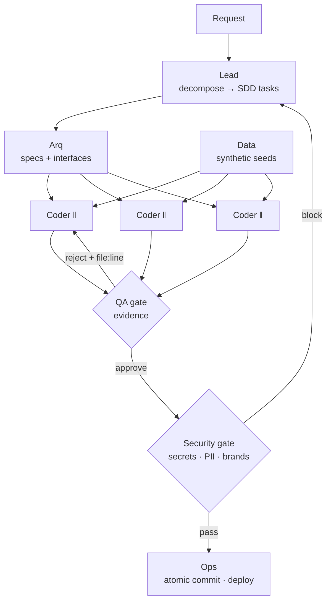

# multi-agent-dev-system — a role-based methodology for shipping software with AI agents

**▶ Live one-pager: https://pvom.github.io/multi-agent-dev-system/**

> ⚠️ Sanitized case study. This documents the **development methodology** I use to build
> and maintain production systems (e.g. MedTrack, a healthcare SaaS). It describes the
> role structure, the workflow rules and the results — it does **not** ship any
> orchestration platform, credentials, or client code. The role prompts here are
> generic templates.

Coding agents are fast but undisciplined: they refactor what you didn't ask for, skip
verification, and lose the thread on multi-step work. This is the **operating model** I
put around them — a small team of **specialized agents with isolated context**, a strict
workflow, and **Spec-Driven Development** — so the output is reviewable, atomic, and safe
to ship.

---

## Why it's different / the problem

A single "do everything" agent accumulates context, drifts, and mixes concerns (it
writes the code, grades its own work, and commits — no separation of duties). This model
fixes that with three ideas:

1. **Role separation with isolated context.** Each agent gets *exactly* the context its
   job needs — nothing inherited from the conversation. The Coder can't see the whole
   history; it sees its task and the interfaces. This keeps each agent focused and keeps
   the coordinator's context free for coordination.
2. **Separation of duties.** Only the **Lead** decomposes work and writes PRs. Only
   **Ops** commits/deploys. **Security** is a hard gate. **QA** approves on evidence, not
   opinion. No single agent both writes and ships.
3. **Spec-Driven Development.** Every unit of work is an **atomic task** with an explicit
   **verification criterion**, traceable to a plan, closed by an **atomic commit**.

## The roles

| Agent | Owns | Never does |
|-------|------|------------|
| **Lead** | Classifies demand, decomposes into SDD tasks, writes PRs, coordinates integration | Implement code · commit |
| **Arq** (Architect) | Standards, per-component specs, interfaces | Implement · commit |
| **Coder** ‖ | Implements one atomic task against defined interfaces; parallelizable | Decide architecture · commit · refactor beyond scope |
| **QA** | Runs the suite, validates acceptance criteria, evidence-based verdict | Fix code (reports back) · commit |
| **Data** | Synthetic datasets, migrations, seeds | — |
| **Security** | Secrets/PII/injection audit — **hard gate** before anything ships | — |
| **Ops** | The *only* role that commits, merges, deploys, backs up | Implement features · decide architecture |
| **Debug** | Root-causes failing systems methodically | — |

The parallelism lives in the **Coder** row: independent tasks run as several Coder
instances at once (`‖`). Everything else is a gate or a coordinator.

## Architecture



## Workflow rules (the guardrails)

- **Only Lead** writes PRs/release notes. **Only Ops** commits, pushes, deploys.
- **Security is a hard gate**: nothing outward-facing ships with a secret, PII, or a
  client brand name.
- **Human approval required** for irreversible/outward-facing actions (public repo,
  push, deploy) — the agents prepare, the human authorizes.
- **SDD**: every task is atomic, has a verification criterion, traces to the plan, and
  closes in an atomic commit.
- **Skill isolation**: agents load only the skills/context their role needs.

## What's in the repo

```
multi-agent-dev-system/
├── README.md
├── roles/                 # sanitized role prompts (generic templates)
│   ├── lead.md
│   ├── coder.md
│   ├── qa.md
│   ├── security.md
│   └── ops.md
├── workflow-rules.md      # the guardrails as an enforceable checklist
└── case-study.md          # applying the model to a real production system (anonymized)
```

## Results

Applied to a real healthcare-SaaS workflow (MedTrack):

- **Separation of duties held**: no agent both authored and shipped a change; every
  deploy carries a QA verdict + a Security pass.
- **Reviewable history**: work lands as atomic, traceable commits instead of large
  mixed diffs.
- **Context efficiency**: role isolation keeps each agent's context small and its output
  on-scope; the coordinator's context stays free for coordination.
- A companion repo, [`agentic-qa-gate`](../agentic-qa-gate), is the **QA role made real**
  — a Playwright merge gate that blocked design-system regressions before production.

## Stack

Anthropic Claude (role-based agents) · Spec-Driven Development · Conventional Commits ·
CI gates. Methodology-first — model/tooling-agnostic.

## Notes on sanitization

This is a **methodology write-up**, not a runnable platform. No orchestration engine,
credentials, hosts, or client code is included. The role prompts are generic templates;
the case study is anonymized. It is deliberately **not** tied to any specific
third-party orchestration product.
